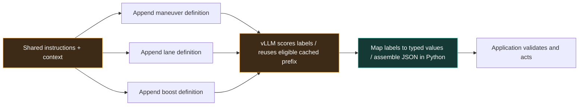

<p align="center">
  
</p>

JEVfire assigns typed variables from finite choices, batching independent fields
through vLLM for parallel execution and reuse of their shared instruction/context
prefix when the engine cache permits it. Inspired by
[JEV / RLCD](https://huggingface.co/harshatheg/Qwen-2.5-1B-RLCD), it uses the
pretrained model's existing language-model head to score verified single-token
labels, maps the winners to allowed values, and assembles JSON in code.

<p align="center">
  <a href="https://github.com/kikoncuo/jevfire/actions/workflows/ci.yml"></a>
  <a href="LICENSE"></a>
  
  
</p>

<h2 align="center">Super Mario. In your browser. 71 ms per action.</h2>

<p align="center"><strong>Qwen3.5 0.8B · Apple M4 Max · WebLLM / WebGPU.</strong><br>
Our World 1-1 recreation, played by local Qwen plus an explicit physics guard.<br>
Final-build run: 71.26 ms mean worker inference · 511 accepted choices · level cleared in 40.12 s.<br>
Excludes model download and CPU forecasting. M4 Max identified by the device owner.<br>
<a href="https://kikoncuo.github.io/jevfire/learn.html"><strong>Explore the visual guide ↗</strong></a> ·
<a href="docs/mario-realtime.md#measurements">Measurement receipt</a></p>

<h3 align="center">On CUDA: 28 decisions. 497 milliseconds. Same 27B model.</h3>

<p align="center"><strong>10.3× faster than generating the equivalent constrained JSON.</strong><br>
Measured median on a synthetic 28-field task with a fresh prefix.<br>
Qwen3.8-27B-FP8 · RTX PRO 6000 Blackwell · vLLM 0.29.0 · five trials per cell.</p>

<p align="center">
  <a href="https://kikoncuo.github.io/jevfire/learn.html"><strong>How it works, visually ↗</strong></a> ·
  <a href="https://kikoncuo.github.io/jevfire/driving.html"><strong>Race four prompts ↗</strong></a> ·
  <a href="https://kikoncuo.github.io/jevfire/mario.html"><strong>Play World 1-1 ↗</strong></a> ·
  <a href="https://kikoncuo.github.io/jevfire/">Village demo</a> ·
  <a href="#quickstart">Quickstart</a> ·
  <a href="benchmarks/README.md">Benchmarks & raw data</a> ·
  <a href="#give-your-game-an-action-layer">Game agents</a> ·
  <a href="docs/api.md">API</a> ·
  <a href="docs/deployment.md">Engine tuning</a>
</p>

Named in tribute to **JEV**, the original inspiration behind this project.
The [JEV / RLCD demo](https://huggingface.co/harshatheg/Qwen-2.5-1B-RLCD)
inspired this independent CUDA/vLLM implementation.

**No retraining. No second model. No autoregressive JSON serialization.**

**The model cannot invent output fields or out-of-set values.** Your supplied
schema defines the keys and choices; application code assembles `parsed_json`.
The model can still select an incorrect allowed value. This is a structural
guarantee, not a guarantee of factual correctness.
[What is guaranteed →](docs/guarantees.md)

<p align="center"></p>

| Workload | Generate constrained JSON | JEVfire | Speedup |
|:--|--:|--:|--:|
| 4 fields · fresh prefix | 877.5 ms | **109.9 ms** | **7.98×** |
| 12 fields · fresh prefix | 2,239.4 ms | **330.1 ms** | **6.78×** |
| 28 fields · fresh prefix | 5,113.1 ms | **496.9 ms** | **10.29×** |
| 28 fields · warm prefix | 5,112.8 ms | **346.3 ms** | **14.77×** |
| Long context, 12 fields · fresh prefix | 2,951.1 ms | **1,060.8 ms** | **2.78×** |

The baseline uses compact, grammar-constrained JSON with thinking disabled;
JEVfire uses the same weights and thinking setting. These are selected
results from the [initial 260-request experiment](benchmarks/initial.md).
Fresh means a new prefix-cache salt, with model weights and kernels already warm.
All fixtures and individual timings are [published](benchmarks/results/benchmark.json).

> **What the headline means:** independent boolean/enum decisions on synthetic
> fixtures, not arbitrary JSON generation. Five samples per cell are an initial
> latency estimate. A separate 2,622-request tuning campaign had zero request
> errors and exact matches throughout; those are repeated fixtures, not 2,622
> independent examples. [Methodology, full results, and limits →](benchmarks/README.md)

## Three browser experiments, one local model

[**World 1-1**](https://kikoncuo.github.io/jevfire/mario.html) recreates the first
Mario course with original drawn artwork. Play yourself, watch an explicit scripted
controller, or let local Qwen select collision-checked maneuvers in continuous
play. The [browser SDK](docs/browser-sdk.md) retains instruction state across
updates and scores one finite maneuver. An explicit physics guard predicts
hazards and handles jump timing. In four recorded continuous runs it cleared
the level every time, averaging **73 ms per decision** and **12.6 decisions/sec**
across all four runs. The final-build run averaged **71.26 ms per action decision**
(rounded to **71 ms**), with **511 accepted choices** and **12.74 accepted choices/sec**
on the device identified by its owner as an **M4 Max**. Worker inference latency
excludes CPU forecasting and model download; it is not the whole control-loop latency.
This is a hybrid Qwen-and-physics result on one authored level.
[Speed research and completion results →](docs/mario-realtime.md) [How the game works →](docs/mario-demo.md)

[**Slipstream**](https://kikoncuo.github.io/jevfire/driving.html) gives four cars
separate prompts and submits all eligible cars together, with cached policies and
no artificial delay between fleet requests. The UI distinguishes fleet decisions
per second, each car's update rate and mean whole-fleet inference time. Four cars
at one update/second require **4 decisions/second**, not one. Results are applied
as each car finishes scoring. In two paired race seeds, the new scheduler made
56% more decisions per second but produced worse race outcomes; faster scoring
did not make the drivers better. [Measured speed and driving quality →](docs/driving-quality.md)

[**Last Hearth**](https://kikoncuo.github.io/jevfire/) gives villagers distinct
roles, personalities and finite jobs. The published demos run the pinned Qwen3.5 0.8B
locally through WebLLM/WebGPU. A local fork can also select DiffusionGemma through
the [Jev server setup](web/README.md#diffusiongemma-through-jev). Browser Qwen field work is sequential with context reuse;
the CUDA/vLLM server's parallel batching and headline benchmarks are separate.

## Why it works

**[Read the interactive field guide →](https://kikoncuo.github.io/jevfire/learn.html)**
Walk through a decision, animate the probability rescaling, inspect cache reuse,
and compare frozen-model scoring with constrained decoding and trained classifiers.

Traditional structured generation emits keys, punctuation, and values token by
token. JEVfire maps each field's options to verified single-token labels,
asks vLLM for their scores, and picks the best label for each field. Your
application gets a JSON object without asking the model to spell it out.



vLLM owns CUDA execution and KV state. JEVfire is a lightweight HTTP sidecar;
it does not load another copy of the model. Each field/chunk scores one output
position. Engine scheduling can still require multiple batches and forward passes.
[Prompt layout, scoring, and differences from JEV / RLCD →](docs/how-it-works.md)

| Capability | Constrained JSON generation | JEVfire |
|:--|:--|:--|
| Output work | Autoregressively emit the object | Score labels; assemble the object in Python |
| Boolean / finite choices | Yes | **1–64 fields; up to 255 choices each** |
| Arbitrary prose, nested schemas, dynamic arrays | Supported when model/backend permit | Current API accepts flat finite fields |
| Cross-field reasoning | Later values can condition on earlier values | Fields are scored independently |
| Model changes | No training required | **No training required** |
| Failure handling | Validate generated output | Reject incomplete/nonfinite scores; no silent default |
| Performance sweet spot | Flexible generative content | **Many independent decisions sharing context** |

### What RLCD means—and what we actually implement

In TypeSafe's terminology, **RLCD means Reinforcement Learning for Calibrated
Decisions**. JEVfire uses pretrained weights and their existing tokenizer;
we have not reproduced Jev's training or architecture. We read scores for verified
token labels, restrict them to the allowed menu, and normalize them. A distribution
summing to 100% expresses relative preference among those choices, not calibrated
confidence that the winner is correct.

**Constrained decoding is another option:** a grammar filters legal next tokens
while the model generates the output. It supports richer nested schemas and free
text where the backend permits. Both approaches can reuse context; neither
guarantees factual correctness. Training can be combined with either approach.

Some open projects really train: **AlexWortega/openjev** fine-tunes Qwen3.5-4B as
an NLI classifier; **Verdict** trains a 151M ModernBERT candidate scorer with
cross-entropy and Brier loss; **RLCR** uses actual reinforcement learning to reward
answer correctness and calibrated confidence. The first two are supervised
methods, despite similar branding. [Verified recipes, model examples, sources,
and limitations →](docs/decision-models.md)

## Give your game an action layer

### Slipstream — four prompts on the starting grid

**[Race in your browser →](https://kikoncuo.github.io/jevfire/driving.html)**

[](https://kikoncuo.github.io/jevfire/driving.html)

*Actual browser race with local Qwen. Prompt following remains experimental.*

Three laps, slower traffic, a wet bend, and four editable driver strategies.
Nova pushes for an early lead, Atlas prioritizes finishing intact, Juno manages
resources, and Milo saves boost for a late charge. Every driver uses the same
car physics and the same local **Qwen 3.5 0.8B** through WebLLM + WebGPU.

Choose speed changes, ordinary or risky overtakes, limited boost, and pit stops.
Pushing too hard through a corner wears tyres and can cause a spin, damage,
or retirement. A six-second pit service repairs and replenishes the car, but
getting there costs track time. The fastest car can lose.

The model sees **position and race gaps; lane-by-lane traffic, closing speeds
and time to contact; corner distance and safe speed; tyres, damage, boost, and
pit distance**. Click any numbered car to inspect its prompt, actual choice,
candidate scores, and the exact observation used. Render FPS and accepted AI
decisions/sec are separate counters. The scripted drive demonstrates the
mechanics without a download; it is explicitly labeled and ignores prompt edits.

Prompts express intended strategies, not guaranteed behavior. A tiny model can
make a valid but poor choice. Steering, following assistance, grip, collisions,
and pit routing are visible game rules; they do not count as model decisions.
[Race design and state contract →](docs/driving-demo.md) ·
[Browser checks and model limitations →](web/qa/README.md#slipstream-driving-demo)

### Play Last Hearth in your browser

**[Keep the village alive →](https://kikoncuo.github.io/jevfire/)**

[](https://kikoncuo.github.io/jevfire/)

*Actual browser gameplay with the local model loaded.*

Six animated villagers face hunger and growing orc waves, with individual
personality prompts: cautious Mira, leisurely Bram, protective Aldric, ambitious
Sable, industrious Tomas, and compassionate Nell. **Collectors** choose safe or
bold foraging; **fighters** train or defend; **builders** repair, build, or heal
wounded allies. Healing spends one stored food for up to twenty health, and every
role can relax when tired, hungry, or hurt. Choices are filtered to useful jobs;
stamina makes Bram take earlier breaks than industrious Tomas.

Automatic needs can interrupt a job to seek and eat real food from the pantry,
a carried basket, or a food patch, then resume the assignment. These visible game
rules consume supplies and do not count as AI decisions; zero hunger still means
death. Write the village orders and role policies that keep everyone alive.

**Qwen 3.5 0.8B runs entirely in your browser through WebLLM + WebGPU**. The
roughly 450 MB download is explicit and cached locally. No API key or inference
server. A separately labeled scripted baseline works without downloading a model.

Click a character or its name to see its **level, XP, current job, and recent
decisions**. Each history entry identifies Qwen, the scripted controller, a game
rule, or automatic needs; the last AI choice includes its time and option scores.
Work earns XP, with one level per 100 XP; levels track experience without extra
combat bonuses. Inspect its observations: nearby orcs, who they are attacking,
food routes, travel estimates, hunger, wounded allies, and damaged buildings.
Inspect available jobs, the model's choice, and any automatic meal break. Edit
the role prompt and see its next choice. **Live AI ticks/sec, eligible-roster
rounds/sec, and render FPS are measured separately.** Actual artist-made 3D characters and village
assets are bundled locally. [Art credits](web/ASSETS.md).

Try asking for a `teleport` field: code still assembles only the declared keys
and allowed actions. This guarantees structure; a legal choice can still get
a villager killed. [How spatial context and policies work →](docs/game-context.md)

The village scores one living NPC at a time in a fair round-robin and reuses
unchanged instructions through the browser SDK. Its sequential WebLLM execution
is distinct from vLLM batching and the CUDA benchmark's speedup.
[Implementation, requirements, and model provenance →](web/README.md)

### Connect your own game


*Concept artwork, not a gameplay capture or benchmark.*

Use an LLM to drive **high-level decisions in a real-time game**: choose a racing
maneuver, a lane, or whether to activate a boost. The game engine keeps rendering
and running physics while an asynchronous decision loop updates its action state.
Our measured latencies suit slower tactical ticks, not a claimed 60 Hz control loop.

```json
{
  "context": "Simulated race: tight bend ahead, low grip, lane clear, boost charged.",
  "schema": {
    "maneuver": {
      "type": "enum",
      "description": "Choose the maneuver. Brake for tight bends with low grip.",
      "choices": ["brake", "coast", "accelerate"]
    },
    "boost": {
      "type": "boolean",
      "description": "Activate boost only on a clear straight with good grip."
    }
  }
}
```

```python
import httpx

result = (
    httpx.post(
        "http://127.0.0.1:8010/v1/decisions",
        json=request,  # the object above
        timeout=120,
    )
    .raise_for_status()
    .json()
)
action = result["parsed_json"]
# Apply your game's action rules before updating its state.
```

Run the included [racing simulation](examples/racing_agent.py):

```bash
python examples/racing_agent.py --steps 8
```

It calls the real endpoint, applies deterministic action guards, advances a toy
simulation, and prints measured decision latency. The game example is illustrative;
the headline benchmark measures extraction fixtures, not racing performance.

| Build | Decisions to score | Application's job |
|:--|:--|:--|
| **Racing game copilot** | Maneuver, lane, boost | Enforce collision/boost rules; advance simulation |
| **NPC tactics** | Attack/retreat, target ID, ability | Check cooldowns and legal action combinations |
| **Tool-using agents** | Tool, urgency, confirmation flag | Validate arguments and permissions; execute tools |
| **Interactive worlds** | Animation, emote, dialogue intent | Map choices to authored assets and behavior |
| **Workflow routing** | Queue, intent, independent tags | Run your existing workflow or graph branch |
| **Document extraction** | Known categories, explicit facts | Handle unknowns and evaluate accuracy |

The endpoint selects actions; your application executes them. Related decisions
need application rules or sequential stages. A [tool-routing example](examples/tool_router.py)
shows how to assemble fixed nested JSON after scoring.

## Images as context

Use the [image context example](examples/image_context.py) to send an image to
a vision-capable vLLM chat endpoint, then score its text observations with JEVfire:

```bash
python examples/image_context.py --image assets/browser-demo.png \
  --vision-url http://127.0.0.1:8020 --vision-model vision \
  --endpoint http://127.0.0.1:8010
```

This requires a running vision-enabled endpoint. The current decision API
accepts text, so this is a two-stage integration with extra vision processing
and observation-generation cost. The browser demo uses symbolic text; it does
not infer from screenshots. [Image payloads, setup, limits, and verification →](docs/image-context.md)

## Quickstart

**Requires Python 3.11+ and an existing compatible vLLM CUDA server.** The tested
backend is vLLM 0.29.0 with Qwen3.8-27B-FP8. Other models need tokenizer, template,
accuracy, and performance checks. [Start the tested backend →](docs/deployment.md)

```bash
git clone https://github.com/mmizutani/jevfire.git
cd jevfire
python -m venv .venv
source .venv/bin/activate
python -m pip install -e '.[dev]'

export DECISION_VLLM_URL=http://127.0.0.1:8000
export DECISION_MODEL=qwen3.8-27b
export DECISION_TOKENIZER=Qwen/Qwen3.8-27B-FP8

python -m uvicorn jevfire.app:app --host 127.0.0.1 --port 8010 --no-access-log
```

In another terminal:

```bash
curl --fail-with-body http://127.0.0.1:8010/v1/decisions \
  -H 'Content-Type: application/json' \
  --data-binary @examples/racing-request.json
```

Explore Swagger at **http://127.0.0.1:8010/docs**. `/health` reports the served model
and active candidate-score limit. The sidecar downloads only the tokenizer if it
isn't cached. Keep it matched to your served model revision.

Stock settings work without an engine patch. For the measured cache behavior,
configure the **verified cache block size for your deployment**. For 129–255
choices in one call, use the optional, version-checked
[256-score patch](docs/deployment.md#optional-256-score-patch).

## The two optimizations that mattered

**Cache the right boundary.** On the tested hybrid-attention model, aligned
prefill cut the long-context, 12-field median from **2,167 → 255 ms** with a warm
prefix: **8.51× versus ordinary batched scoring**. The fresh-prefix improvement
was **2.77×**. These are cache-strategy comparisons, separate from the JSON table.

**Score more candidates per call.** The optional vLLM 0.29 patch raises the
requested-score cap from 128 to 256. Warm 255-choice throughput rose from
**3.85 → 7.54 requests/s**, **1.96× versus the two-call scoring path**, with identical
raw scores in the recorded probes. Against JSON on the same engine, the patched
path was **23% faster warm** and **slightly slower fresh** at concurrency four.

Increasing the batch-token budget from 2,096 to 4,096 or 8,192 did **not** give a
consistent improvement and reduced available KV cache by about 17–18% under
the fixed memory allocation. [All tuning experiments →](benchmarks/tuning.md)

## Boundaries worth understanding

- **Finite outputs:** booleans or 2–255 string choices per field. No arbitrary
  prose, generated array length, nested request schemas, or unbounded numbers.
  Your code can wrap returned fields into fixed nested objects/arrays.
- **Independent fields:** values do not condition on sibling answers. Encode a
  joint action as one enum or stage dependent decisions sequentially.
- **Uncalibrated scores:** relative label probabilities are not probabilities
  that an answer is correct. Surrogate labels and option order can introduce bias.
- **New context still costs compute:** longer prompts require prefill; cache reuse
  helps only where prefixes match and the engine can reuse them.
- **Latency is not your bill:** measured speedups do not imply identical throughput,
  energy, or dollar savings. Published energy estimates cover a shared GPU.
- **Experimental release:** representative task accuracy and other models still
  need evaluation. Include an explicit `unknown` choice when evidence can be absent.

## Explore the repo

| Start here | What you'll find |
|:--|:--|
| [API reference](docs/api.md) | Request/response contract, strategies, errors, abstention |
| [Deployment](docs/deployment.md) | CUDA backend, cache configuration, optional patch and rollback |
| [Benchmarks](benchmarks/README.md) | Reproduction commands, complete data, methodology |
| [Scoring engine](jevfire/core.py) | Shared prompts, verified labels, score merging, typed output |
| [Tests](tests) | CPU contracts and opt-in live CUDA checks |
| [Artwork](docs/art-direction.md) | Original artwork, generation prompts, reproducible chart |

Inspired by **JEV** and [harshatheg's RLCD demo](https://huggingface.co/harshatheg/Qwen-2.5-1B-RLCD).
Built with [vLLM](https://github.com/vllm-project/vllm), FastAPI and Hugging Face
tokenizers. Independent project; see [third-party notices](THIRD_PARTY_NOTICES.md).
Code is [MIT licensed](LICENSE).

<p align="center"><strong>Spend tokens on decisions. Let code build the JSON.</strong></p>
